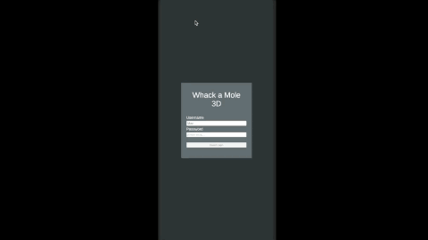

# Showcase

## Whack a mole with a client server
First time experiencing client server programming with SmartFoxServer. this is a whack a mole 3D game that you generally find in arcade game combine it with Server to play Multiplayer. it only works on the same network  
project duration: 7 days

### Tools
Unity 2022.3.42f1
 [SmartfoxServer](https://smartfoxserver.com/)

### How To Install
1. download SmartFoxServer (https://smartfoxserver.com/download/sfs2x#p=installer) or (https://smartfoxserver.com/download/get/306)
2. install Locally
3. copy paste server code folder into C:\Users\username\SmartFoxServer_2X\SFS2X\extensions
4. Run the server using standalone by launching sfs2x-standalone.exe in C:\Users\username\SmartFoxServer_2X\SFS2X
5. go to admin tool localhost:8080/admin
6. enter admin tool with username: sfsadmin, password: sfsadmin
7. open the zone configurator
8. Create zone and give it a name "SFSMole", and click submit
9. double click SFSMole room, select zone extension to setup the extension, after that click submit.
name: Servercode
Type: Java
MainClass: ZoneExtension

10. Create room "WhackRoom"
11. double click the "WhackRoom", click room extension to configure room.
Name: Servercode
Type: Java
MainClass:Room.RoomExtension

12. start the SFSMole zone. select your SFSMole and click the play button.
13. restart the server to apply zone and room.

### Playing The game
1. Add Unity Project folder with your unity hub. it use Unity 2022.3.42f1
2. After you done importing it, open Main.scene
3. Select MainController -> Server and change the host to be either 127.0.0.1 or localhost
4. press play to play the game.

### How to play from other PC
****Server Setup
1. Make sure that your server firewall allow both connection for unity and SmartFoxServer
2. check your IP Address ex: 192.168.110.50 

**** other PC
1. open any browser and try 192.168.110.50:8080/admin to check if this PC can connect to server
2. open the game on your other PC
3. open main.scene
4. Select MainController -> Server and change the host to 192.168.110.50
5. play the game
